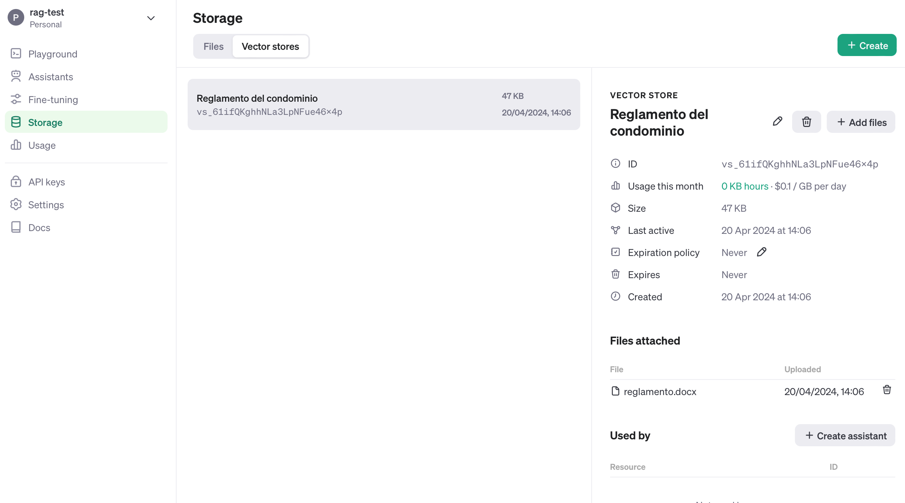

# opeanai-rag-test

Testing [OpenAI RAG capabilities](https://platform.openai.com/docs/assistants/tools/file-search/quickstart) called file search with a Spanish Document (Still in beta)

This simple python programs indexes one or many documents using OpenAI's new Retrieval Augmented Generation Capabilities (RAG). This has a cost depending on the size of the document you use, and how many questions you ask.

I used a Spanish document, that contains the regulations of my former condominium in Santa Cruz, Bolivia. I have lived for the last decade in Finland but wanted to try something in a different language that english.

Here you can see how the Vector Store created looks in OpenAI page:



I asked the following question:

Q: ¿Cuando se pueden hacer fiestas en el condominio?
A: De acuerdo al reglamento del condominio, los propietarios o inquilinos tienen el derecho de realizar fiestas en sus viviendas siempre que consideren que sus vecinos necesitan descanso. La música estruendosa, las voces fuertes, y otros ruidos molestos deben cesar de lunes a jueves hasta las 23:00 horas, y los días viernes, sábado y vísperas de feriado hasta la 01:00 a.m.[0].

In english:

Q: When can parties be held in the condominium?

A: According to the condominium regulations, owners or tenants have the right to hold parties in their homes, considering that their neighboors need rest. Loud music, loud voices, and other disturbing noises must cease from Monday to Thursday until 11:00 p.m., and on Fridays, Saturdays, and the eve of holidays until 1:00 a.m.

Which is exactly what is contained in the original text:

Artículo 11.- (NORMAS PARA FIESTAS FAMILIARES) Cualquier propietario o inquilino está en todo su derecho para festejar los acontecimientos sociales en su propia vivienda, cuantas veces disponga, pero también debe considerar, que sus vecinos descansan. Gocemos de nuestros derechos y respetemos el descanso ajeno, cortando la música estruendosa, las voces fuertes y cualquier ruido molesto, de lunes a jueves hasta las 23:00 Hrs. y los días viernes, sábado y vísperas de feriado hasta los 01:00 a.m. Hrs.

In english:

Article 11.- (RULES FOR FAMILY PARTIES) Any owner or tenant has every right to celebrate social events in their own home, as many times as they wish, but they must also consider that their neighbors need rest. Let's enjoy our rights and respect other people's rest, cutting off loud music, loud voices and any annoying noise, from Monday to Thursday until 11:00 p.m. and on Fridays, Saturdays and the eve of holidays until 01:00 a.m. Hrs.

## Prerequisites

VScode is recommended but not mandatory

* Python 3.9+
* An OpenAI key
* A Microsoft Word/PDF document to be ingested by the program. All [supported types](https://platform.openai.com/docs/assistants/tools/file-search/supported-files).

## Setup

Clone or download [this sample's repository](https://github.com/MiguelElGallo/opeanai-rag-test), and open the `opeanai-rag-test` folder in Visual Studio Code or your preferred editor (if you're using the Azure CLI).

## Running the sample

1. Create a .env file, this file should contain the following:

    ```yaml
    OPENAI_API_KEY = youropenaikey
    ```

2. Create a [Python virtual environment](https://docs.python.org/3/tutorial/venv.html#creating-virtual-environments) and activate it.
    You can name the environment .venv for example:

    ```log
    python -m venv .venv
    ```

    This name .venv keeps the directory typically hidden in your shell and thus out of the way while giving it a name that explains why the directory exists.
    Activate it following the instructions from the [link](https://docs.python.org/3/tutorial/venv.html#creating-virtual-environments).

3. Run the command below to install the necessary requirements.

    ```log
    python3 -m pip install -r requirements.txt
    ```

4. Update file main.py
   Change this line to the name of your document

    ```python
    file_paths = ["reglamento.docx"]
    ```

    And the question you want the model to answer:

     ```python
    content="Cuando se puede hacer fiestas en el condominio?",
    ```

5. run file main.py 
